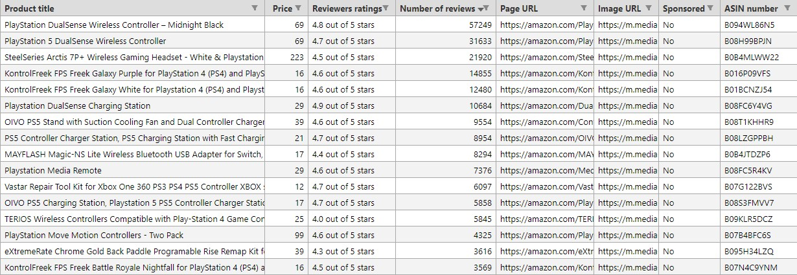

# **amazon-scraper**

A python script writing using `requests` and `BeautifulSoup` modules for web scraping.

# Description

This Python script allows you to scrape data about a specific product on [**amazon.com**](https://amazon.com) (US version) and save the data to a CSV file for further processing and analysis.

# Disclaimer

This is a non-official client to have some data about products sold on Amazon, your **IP address** may be banned from frequent requests using this script because Amazon doesn't like bots scraping data out of their website, ***use it at your own risk***.

I encourage you to use a VPN or a proxy while using the script to protect yourself from getting banned.<br>
If you got banned while using a VPN or a proxy, you can just switch your **IP address or the server location** and it will work again.

# Usage

You can use this script in the command line by typing `py amazon_scraper.py`
You will be prompted to enter what you want to search for.

```bash
$ py amazon_scraper.py
Search amazon.com: PS5 controller
Fetching data, Please wait...

100%|▇▇▇▇▇▇▇▇▇▇|Overall time: 00:10| Total pages downloaded: 20
100%|▇▇▇▇▇▇▇▇▇▇|Extracting data from page: 20/20 web pages.

Product data saved to a CSV file.
```

# Script Output

The output of this script is a CSV file named after the search term you used to search on amazon.com, i.e. `PS5 controller.csv`

- The CSV file will be saved in a folder relative to the `amazon_scraper.py` script location `..\amazon_CSV_files\<search_term>.csv`

example for a CSV table with more than 400+ records (or 20 pages) being downloaded using the script



# Data attributes

These are the type of data being scraped from amazon.com

| Attribute | Description |
| --------- | ----------- |
| Product title | Product title |
| Price | Price of the product in US dollars |
| Reviewers ratings | Product rating (from 1 to 5 stars) |
| Number of reviews | Number of people reviewed the product |
| Page URL | URL of the product's page |
| Image URL | URL of the product's image (size 3x bigger than the normal thumbnail) |
| Sponsored | Is the product sponsored ("Yes" or "No")
| ASIN | Amazon Standard Identification Number |
